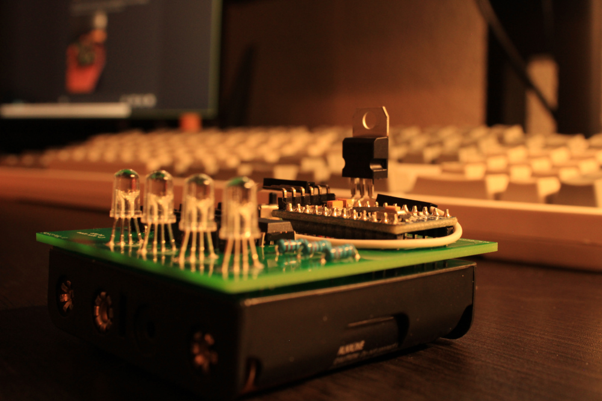
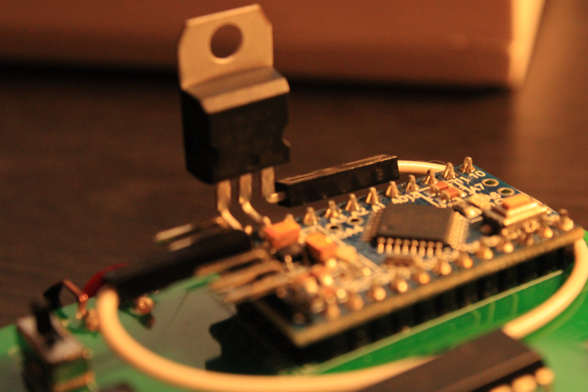
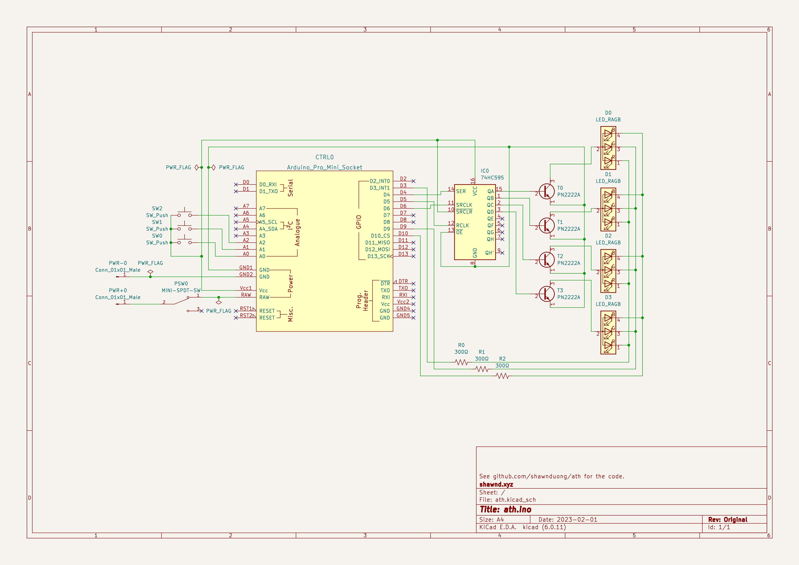

# ath.ino

ath.ino is a simple circuit board that displays a binary message with LEDs, one nibble at a time. This was my first time creating a PCB and this project mainly serves as educational experience and material.

## Images

(The 5V voltage regulator is not needed for this project. It is shown in mine because my Arduino's onboard voltage regulator is broken. See the note at the bottom of this README.)

## Schematic

## Materials

To create this project, you need:

1. 1x Arduino Pro Mini
2. 1x SN74HC595N Shift Register
3. 3x 100 Ohm resistors
   - Other resistor values will substitute just fine depending on the maximum brightness you want for the LEDs.
4. 4x 2n2222 transistors
   - Other transistors can substitute as long as the middle pin is the base.
5. 3x Push buttons
6. 1x Micro slide switches
7. 1x 4x AAAA battery holder
8. 4x RGB common cathode LEDs

## Instructions

1. Print the PCB and solder the parts according to the schematics. The schematics can be viewed in a PCB CAD program such as KiCAD.
2. Upload the code in `src/ath.ino`. Change the `byte sequence[]` variable to be your desired values.

## Usage

Power the LED on by flipping the power switch (PSW0). Dim the R, G, and B levels by pushing SW0, SW1, and SW2, respectively. After reaching the minimum dimness level, the color channel will loop back to the maximum.

## Note

If the onboard voltage regulator in the Arduino is broken, you can connect a 5V voltage regulator the VIN/GND of the Arduino and connect Vout to the 5V line in the Arduino.
